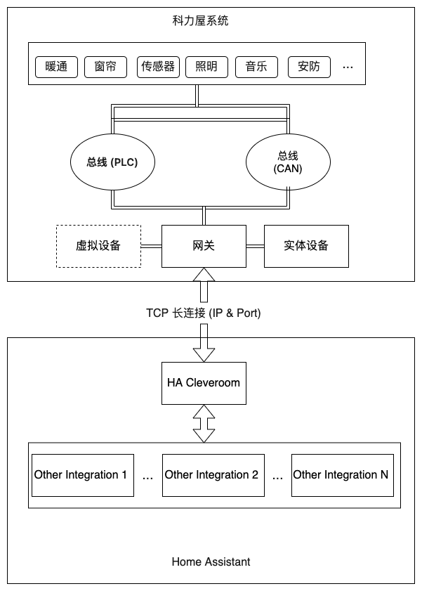

# 科力屋智能家居系统集成 Home Assistant 插件
[English](./README.md) | [简体中文](./README_zh-CN.md)

该程序为HomeAssistant的插件,通过此插件可以将科力屋智能家居系统的设备接入到HomeAssistant中进行控制和管理。

---

## 安装方式

- 1.在 HACS -> 自定义存储库, 添加插件的`存储库`为 "https://github.com/cleveroom-code/ha-cleveroom-home" 并选择类别为`集成`. 选择名为 `Cleveroom` 的插件并点击下载安装.

- 2.重启 Home Assistant .

---
## 配置方法

- 1.在系统 设置 > 设备与服务 > 添加集成 > `Cleveroom`. 会弹出 `Cleveroom` 的配置界面.

- 2.选择内网中搜到的科力屋网关设备，选中设备进入下一步或者不选择设备点击下一步手动输入信息.

- 3.选择网关进入下一步会自动填充网关的IP和端口号及授权码和密码相关信息.

- 4.如果需要按科力屋系统的区域结构创建楼层和房间则选择自动生成区域，如果不需要则选择不自动生成房间即可.

- 5.点击完成即可，初始化可能会需要5-7秒钟的时间加载数据.
- 

提示：设备接入Home Assistant之前，请确认科力屋系统已经调试完成并正常使用，这一步很重要，可以减少你重复配置的时间.

---
## 功能支持

### 灯光(Light)
   
    支持开关、调光、调色温、调色彩功能

### 开关(Switch)
    
    支持开关，比如一些插座、家电类

### 传感器(Sensor)

    支持温湿度、亮度、PM2.5、PM10、CO2、VOC、甲醛、风速、雨量、大气压强等传感器

### 二元传感器(Binary-Sensor)

    支持门磁、烟雾、气感、人感等传感器，支持任意二元状态的干接点的接入

### 暖通(空调、地暖)(Climate)

    支持空调、地暖设备的接入，可以对其进行温控、风速、风向、开关等操作功能

### 窗帘(Cover)

    支持窗帘、百叶窗、天棚帘等设备的接入，支持开、关、停、百分比等操作功能

### 新风系统(Fan)

    支持新风系统的接入，可以对其进行开关、风速操作功能

### 情景(Scene)
    
    支持科力屋内置情景模式的接入，可以对其进行触发操作

### 音乐播放器(Media-Player)

    支持科力屋内置音响的接入，可以对其进行音量、播放、暂停、上一曲、下一曲、文件夹切换、音源切换操作

### 安防报警(AlarmControlPanel)

    支持科力屋内置安防报警的接入，可以对其进行布防、撤防、布防状态查询操作

### 按钮(Button)

    按钮作为触发的入口，支持3按钮类型的实体，分别实现清空插件缓存、搜索设备、重新加载插件这3个功能，用于对插件附加操作的补充，这些功能在接入初期会用到，稳定以后使用的较少

---

## 系统交互

科力屋系统是一个有线架构的智能家居系统，有两种总线架构，分别是CANBUS和电力载波(PLC)及两者的融合架构，两种各有优势,CANBUS稳定可靠，PLC布线简单适合后装和改装，它们支持相同的设备单元，对外部系统无感知

说明：
- 1.科力屋的插件加载以后会自动连接科力屋的网关，当网络异常的时候每15秒钟会尝试重新连接一次网关.
- 2.插件加载以后会自动搜索科力屋系统的设备，搜索到的设备会在Home Assistant中生成对应的实体，如果已经在系统中则更新实体的状态，并通知状态机刷新状态
- 3.如果在Home Assistant中对实体进行操作，插件会将操作指令发送到科力屋的网关，网关会将指令转发到对应的设备上执行，当系统的设备状态发生变化时，网关会将状态变化推送到插件，插件会将状态变化更新到Home Assistant中.
- 4.虽然科力屋保持长连接可以实时更新状态，但是保留30秒自动刷新状态的功能是为了防止网络异常或者网关掉线等情况导致的状态不同步问题.
- 5.科力屋系统有实体设备和虚拟设备两种概念，实体设备是实际存在科力屋系统中的设备，虚拟设备是外部设备在科力屋系统中的一个映射，科力屋系统通过对虚拟设备的控制来联动控制外部系统的设备
- 6.科力屋系统的实体设备和虚拟设备都可以在Home Assistant中进行控制，实体设备的控制会直接发送到科力屋系统中，虚拟设备的控制会先发送到科力屋系统中，然后由科力屋系统转发到外部系统中
- 7.虚拟设备的创建和删除需要在科力屋系统中进行，插件会自动搜索到虚拟设备并在Home Assistant中生成对应的实体，第三方设备可以监听虚拟设备的状态变化来实现联动，也可以通过虚拟设备的控制来实现联动